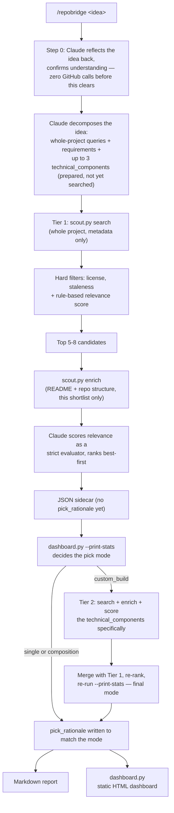

# RepoBridge

Building apps has never been easier with AI tools. Type out an idea and you can have working code in minutes. But there's a catch: most people are using AI to rebuild things that already exist, instead of building on top of what's already out there.

That used to be the default instinct in software engineering. Before writing a line of code, you'd look for a library or a project that already solved part of your problem, then build the rest on top of it. AI made generating code so cheap that people stopped bothering, and it shows: bloated, fragile apps full of code that never needed to be written in the first place.

RepoBridge brings that habit back. You talk through your app idea the same way you'd talk to any AI coding tool, and instead of jumping straight into writing code, it searches real GitHub repositories for ones that already do most of what you're describing. It maps your idea against what it finds, tells you honestly how much is already covered, and shows you exactly what's left to build. It doesn't write your app for you. It hands you a real starting point and an honest list of what's missing.

## Demo

**Idea:** *local-first markdown note-taking app with a minimalist editor and local AI embeddings for semantic clustering and tag suggestion*

<p align="center">
  
</p>
<p align="center">
  
</p>

*From a real run. Full report: [`local-markdown-notes-ai-20260813.md`](repobridge-reports/local-markdown-notes-ai-20260813.md).*

## Why this beats starting from scratch

- You're not rebuilding things that already exist and have already been tested by real users.
- Less code for you or your AI tool to write means fewer bugs, less wasted token usage, and a smaller codebase to maintain.
- You start from something a real community has used and refined, not something an AI made up from a blank page.
- You still see exactly what's missing and what you'll need to build yourself. Nothing is hidden or oversold.

## How it works



Retrieval and scoring happen in stages, so the expensive work (fetching READMEs, checking for CI/Docker/deploy config) only runs on a short, pre-filtered list, not every repo a search turns up. Full design rationale is in [`docs/plan.md`](docs/plan.md). A few decisions worth knowing about:

- **Copyleft (GPL/AGPL) is blocked by default.** Avoids an unintended copyleft obligation on a closed-source project. Override with `--allow-copyleft`.
- **Staleness cutoff is 12 months.** A quiet repo isn't always a dead one. Recency affects ranking, not eligibility.
- **Step 0 is a real gate.** Claude confirms your idea before searching, so a misread idea doesn't waste a whole run.
- **Pick mode is a fixed threshold, not a judgment call.** See "The pick" below.
- **Tier 2 only runs if Tier 1 comes up empty.** A whole-project search for something like "React Native habit tracker" often surfaces generic frameworks instead of real matches. When that happens, RepoBridge searches for the idea's specific technical pieces instead, like "React Native full-screen alarm." It's a one-time escalation, not a default second pass.

## Quickstart

**Prerequisites:** Python 3, and GitHub auth via either:
- `gh auth login` (uses your existing GitHub CLI session), or
- a `GITHUB_TOKEN` environment variable

No `pip install`. Every script here is Python stdlib only, by design. No database, no server, no API key beyond GitHub's own.

```bash
/repobridge habit tracker with streaks and social accountability
```

This runs inside Claude Code as a skill. Claude handles the reasoning (queries, relevance judgment, gap analysis); the Python scripts handle the deterministic parts (search, filter, score, pick mode). The first response just reflects your idea back for confirmation. Nothing hits the GitHub API until you approve it.

You can also drive the retrieval engine directly, without Claude, for debugging or scripting:

```bash
python3 .claude/skills/repobridge/scout.py search \
  --queries "habit tracker streaks" "accountability partner app" \
  --requirements "streak tracking" "social accountability" "reminders" \
  --min-stars 50 --limit 30

python3 .claude/skills/repobridge/scout.py enrich \
  --repos redpangilinan/iotawise daya0576/beaverhabits
```

## What's in the box

```
.claude/skills/repobridge/
  scout.py        deterministic GitHub retrieval + rule-based scoring (stdlib only)
  dashboard.py    turns scout.py/SKILL.md JSON output into a static HTML dashboard
  SKILL.md        the /repobridge workflow Claude follows
  README.md       skill-level usage notes
tests/
  test_scout.py   33 unit tests against the real scout.py — see Testing below
docs/
  plan.md         the design plan, including review notes and rejected alternatives
repobridge-reports/
  *.md            generated feature-gap reports (one per idea)
  *.json          structured sidecar data behind each report
  *.html          static dashboards generated from that data
```

## The pick

Each run produces three files from one JSON sidecar, so they can't disagree: a markdown report, the sidecar itself, and a static HTML dashboard.

The dashboard leads with one answer, not a list. What goes in that hero card is decided by a fixed coverage threshold in `dashboard.py`'s `compute_pick()`, never by the AI:

| Mode | When | Hero shows |
|---|---|---|
| **single** | The best repo alone covers ≥70% of requirements | That repo, why it won over the runner-up |
| **composition** | No repo clears 70% alone, but the top 3 together do, with a real margin | The 2-3 repos stitched together, which one covers which requirement (derived mechanically, never hand-assigned), and why combining them makes sense |
| **custom_build** | Nothing clears 70%, alone or combined | Said plainly. The closest reference found, framed as a reference point, not a recommendation |

Whichever mode applies, the hero also shows four headline numbers:

| Stat | What it means |
|---|---|
| **Match %** | Present + half-credit Partial, as a share of the idea's stated requirements (joint coverage in composition mode) |
| **Features left** | Count of Missing + Partial requirements for the pick |
| **Est. time remaining** | Heuristic: hours per missing/partial feature, converted to days |
| **Tokens saved** | Heuristic: tokens an LLM would spend generating the covered portion from scratch |

The last two are estimates, not measurements. Their formula lives in `dashboard.py`, and the methodology note always sits next to the numbers. `dashboard.py --print-stats` prints these same numbers as JSON, so the markdown report states the exact figures instead of Claude recalculating them by hand.

Below the hero is the full comparison: stars, license, verified/deployability scores, and a Present/Partial/Missing grid for every candidate, each cell backed by a quote from the README. The single answer up top never hides the audit trail underneath it.

Each candidate also carries a `found_via` label, either `"whole-project search"` or `"component search: <name>"`, shown on its card and in the report. If a composition mixes pieces from both, the report says exactly which repo came from which search.

A real, unmocked example is checked into `repobridge-reports/`: a habit-tracker idea where none of the four candidates found actually had a social-accountability feature. That's the kind of honest gap this tool is built to surface, not a cherry-picked success story.

## Testing

```bash
python3 -m unittest discover -s tests -v
```

33 tests, no network calls, nothing mocked into passing. They exercise the real functions in `scout.py`:

- the license allowlist and copyleft block
- the staleness cutoff, at the default and a custom threshold
- the `metadata_score` formula (recency, star cap, keyword overlap)
- the awesome-list link-extraction regex (exclusions, dedup)
- GitHub auth resolution (env var, `gh` CLI fallback, both failure modes)
- `api_request`'s fail-loud behavior on rate limits vs. its soft-fail on expected 404s

## Guardrails

- **Fail loud, never degrade silently.** Missing auth, a rate limit, or zero candidates all exit with a clear error. Never a guessed result presented as real.
- **No dynamic execution of fetched content.** README text and repo metadata are data, never `eval`'d or shelled out.
- **Deterministic scoring stays auditable.** Every score ships with the exact signals behind it (`score_breakdown`, `verified_signals`, `deployability_signals`). No hidden weighting.
- **All GitHub access goes through `scout.py`.** Claude never calls the API directly, so auth, filtering, and error handling live in one place.
- **No secrets in output.** The token is read from the environment and never echoed, including in error messages.
- **Estimates are labeled as estimates.** Time-remaining and tokens-saved are heuristics, not measurements, and always ship with the methodology note.
- **The pick mode is never decided by hand.** Single, composition, or custom-build, plus the composition's requirement-to-repo mapping, always comes from `dashboard.py --print-stats`.
- **The confirmation gate isn't skippable.** Even an idea that looks obviously clear still gets a one-turn reflect-and-confirm before any search query is built.

## What this deliberately doesn't do

RepoBridge stops at analysis. It doesn't clone repos, write application code, or handle the actual "diff-only" build step. That's a separate, easier problem, mostly a well-scoped prompt. The harder question, and the one this tool actually answers, is whether something you need already exists.
