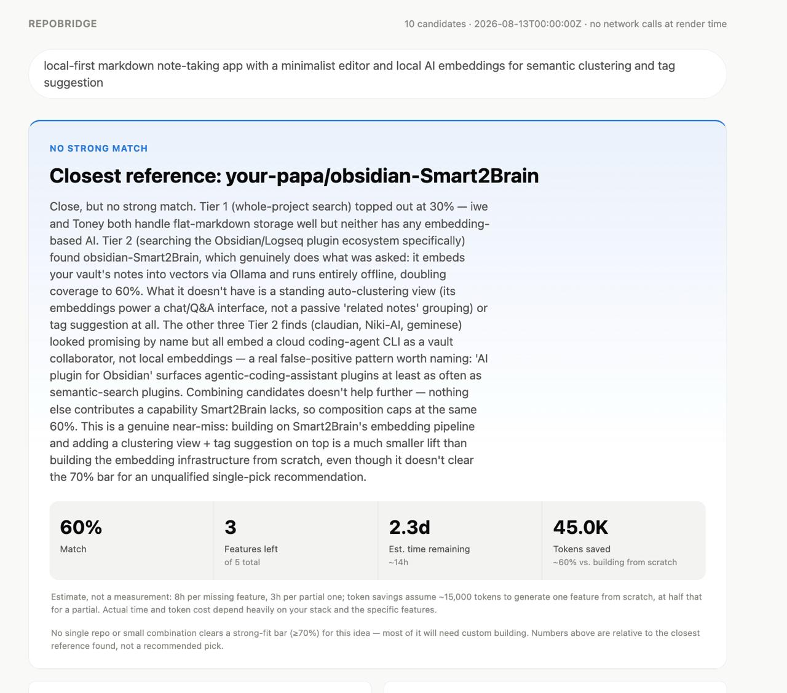
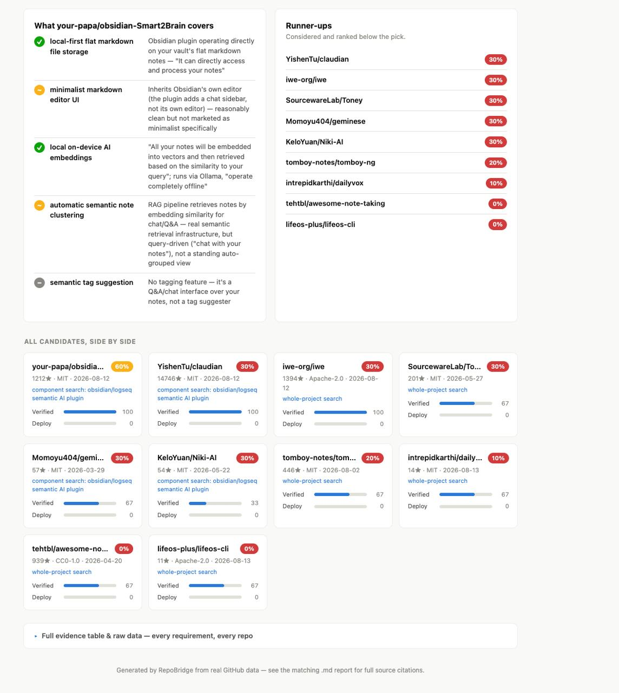
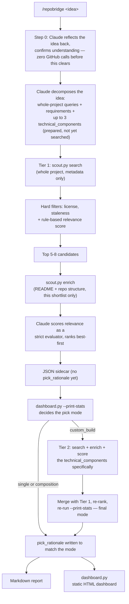

# RepoBridge

Building apps has never been easier with AI tools. Type out an idea and you can have working code in minutes. But there's a catch: most people are using AI to rebuild things that already exist, instead of building on top of what's already out there.

That used to be the default instinct in software engineering. Before writing a line of code, you'd look for a library or a project that already solved part of your problem, then build the rest on top of it. AI made generating code so cheap that people stopped bothering, and it shows: bloated, fragile apps full of code that never needed to be written in the first place.

RepoBridge brings that habit back. You talk through your app idea the same way you'd talk to any AI coding tool, and instead of jumping straight into writing code, it searches real GitHub repositories for ones that already do most of what you're describing. It maps your idea against what it finds, tells you honestly how much is already covered, and shows you exactly what's left to build. It doesn't write your app for you. It hands you a real starting point and an honest list of what's missing.

<p align="center">
  
</p>
<p align="center">
  
</p>

*From a real run, see [`local-markdown-notes-ai-20260813.md`](repobridge-reports/local-markdown-notes-ai-20260813.md) for the full report behind this dashboard.*

## Why this beats starting from scratch

- You're not rebuilding things that already exist and have already been tested by real users.
- Less code for you or your AI tool to write means fewer bugs, less wasted token usage, and a smaller codebase to maintain.
- You start from something a real community has used and refined, not something an AI made up from a blank page.
- You still see exactly what's missing and what you'll need to build yourself. Nothing is hidden or oversold.

## How it works



Retrieval and scoring are deliberately split into stages so the expensive work (fetching README text, checking for CI/Docker/deploy config) only ever runs against a handful of pre-filtered candidates, not every repo that shows up in a search. See [`docs/plan.md`](docs/plan.md) for the full design rationale, including specific tradeoffs made on purpose:

- **Copyleft licenses (GPL/AGPL) are hard-blocked by default.** A builder using this without a lawyer in the loop shouldn't be able to silently walk into a copyleft obligation on a closed-source project. Override with `--allow-copyleft` if you know what you're doing.
- **The staleness cutoff is 12 months, not 6.** A stable, feature-complete repo can go months without a commit without being abandoned — a tighter cutoff would systematically exclude exactly the kind of "boring, finished" code this tool should prefer. Recency instead weights the *ranking*, not a hard gate.
- **Step 0 is a real gate, not a formality.** Going straight from a one-line idea to search queries risks locking in a guessed interpretation before anyone can correct it. It's adaptive, not a forced wizard — a clear idea gets a one-turn reflect-and-confirm, not a multi-round interrogation.
- **The pick mode is a fixed threshold, not an LLM judgment call.** See "The pick" below.
- **Tier 2 (component search) only fires on `custom_build`, not every run.** Whole-project searches for something like "React Native habit tracker" tend to surface generic high-star infrastructure (the RN framework itself, UI kits) rather than actual matches — a real failure mode, not hypothetical (see the worked example below). When that happens, searching for the idea's discrete technical primitives specifically (e.g. "React Native full-screen alarm" instead of "habit app") finds better candidates than hoping they surface as a side effect of a whole-app query. It's an escalation, run once, not a default second pass — if Tier 1 already found a strong single repo or a strong composition, spending more search calls chasing a marginally better answer isn't worth it.

## Quickstart

**Prerequisites:** Python 3, and GitHub auth via either:
- `gh auth login` (uses your existing GitHub CLI session), or
- a `GITHUB_TOKEN` environment variable

No `pip install` — every script here is Python stdlib only, by design. No database, no server, no API key beyond GitHub's own.

```bash
/repobridge habit tracker with streaks and social accountability
```

This runs inside Claude Code as a skill (`.claude/skills/repobridge/SKILL.md`) — Claude does the semantic reasoning (query generation, relevance judgment, gap analysis); the Python scripts do the deterministic, auditable parts (search, filter, score, pick mode). First response is a plain-language reflection of the idea asking you to confirm it — nothing hits the GitHub API until you do.

You can also drive the retrieval engine directly, without Claude, for debugging or scripting:

```bash
python3 .claude/skills/repobridge/scout.py search \
  --queries "habit tracker streaks" "accountability partner app" \
  --requirements "streak tracking" "social accountability" "reminders" \
  --min-stars 50 --limit 30

python3 .claude/skills/repobridge/scout.py enrich \
  --repos redpangilinan/iotawise daya0576/beaverhabits
```

## What's in the box

```
.claude/skills/repobridge/
  scout.py        deterministic GitHub retrieval + rule-based scoring (stdlib only)
  dashboard.py    turns scout.py/SKILL.md JSON output into a static HTML dashboard
  SKILL.md        the /repobridge workflow Claude follows
  README.md       skill-level usage notes
tests/
  test_scout.py   33 unit tests against the real scout.py — see Testing below
docs/
  plan.md         the design plan, including review notes and rejected alternatives
repobridge-reports/
  *.md            generated feature-gap reports (one per idea)
  *.json          structured sidecar data behind each report
  *.html          static dashboards generated from that data
```

## The pick

Each run produces three artifacts for a given idea, all generated from one JSON sidecar so they can never disagree: a markdown report, the sidecar itself, and a static HTML dashboard.

The dashboard leads with a single answer, not a list — a hero card, in the spirit of a clean dark-mode answer page. What's *in* that hero card depends on a fixed coverage threshold (`dashboard.py`'s `compute_pick()`), never an LLM judgment call:

| Mode | When | Hero shows |
|---|---|---|
| **single** | The best repo alone covers ≥70% of requirements | That repo, why it won over the runner-up |
| **composition** | No repo clears 70% alone, but the top 3 together do, with a real margin | The 2-3 repos stitched together, which one covers which requirement (derived mechanically, never hand-assigned), and why combining them makes sense |
| **custom_build** | Nothing clears 70%, alone or combined | Said plainly — the closest reference found, framed as a reference point, not a recommendation |

Whichever mode applies, the hero also shows four headline numbers:

| Stat | What it means |
|---|---|
| **Match %** | Present + half-credit Partial, as a share of the idea's stated requirements (joint coverage in composition mode) |
| **Features left** | Count of Missing + Partial requirements for the pick |
| **Est. time remaining** | Heuristic: hours per missing/partial feature, converted to days |
| **Tokens saved** | Heuristic: tokens an LLM would spend generating the covered portion from scratch |

The last two are explicitly estimates, not measurements — the fixed formula behind them (and its constants) lives in `dashboard.py`, and the page always shows the methodology note beside the numbers rather than presenting them as precise. `dashboard.py --print-stats` prints the same numbers (mode included) as JSON so the markdown report states the identical figures instead of Claude re-deriving them by hand.

Below the hero, every artifact still shows the full comparison — stars, license, verified/deployability scores, and a Present/Partial/Missing grid for every candidate considered, each cell backed by a one-line evidence quote from the README. The single-answer framing up top never comes at the cost of the audit trail underneath it, and it never depends on which mode won.

Each candidate also carries a `found_via` label — `"whole-project search"` or `"component search: <name>"` — shown on its compare-card and disclosed in the report. When a composition mixes pieces from both, the report says explicitly which repo came from which search, not just that they were combined.

A worked example, from a real (unmocked) run against the idea *"habit tracker with streaks and social accountability"*, is checked into `repobridge-reports/`. Its headline finding — none of the four real candidates found had any social-accountability feature — is exactly the kind of honest gap this tool exists to surface; it's not a cherry-picked success case.

## Testing

```bash
python3 -m unittest discover -s tests -v
```

33 tests, no network calls, no mocked-into-passing assumptions — they exercise the actual functions in `scout.py`: the license allowlist and copyleft block, the staleness cutoff at both the default and a custom threshold, the `metadata_score` formula (recency + star cap + keyword overlap), the awesome-list link-extraction regex (including exclusions and dedup), GitHub auth resolution (env var, `gh` CLI fallback, both failure modes), and `api_request`'s fail-loud behavior on rate limits versus its configurable soft-fail on expected 404s.

## Guardrails

- **Fail loud, never degrade silently.** Missing auth, a rate limit, or zero surviving candidates all exit non-zero with a clear message — never a guessed or partial result presented as real.
- **No dynamic execution of fetched content.** README text and repo metadata are data, never `eval`'d or shelled out.
- **Deterministic scoring stays auditable.** Every score ships alongside the exact signals that produced it (`score_breakdown`, `verified_signals`, `deployability_signals`) — nothing is a hidden weighting.
- **All GitHub access goes through `scout.py`.** Claude never calls the API directly, so auth, filtering, and error-handling logic live in one place.
- **No secrets in output.** The token is read from the environment and never echoed, including in error messages.
- **Estimates are labeled as estimates.** Time-remaining and tokens-saved are heuristic, not measured — they always ship with the formula's methodology note, never as bare precise-looking numbers.
- **The pick mode is never decided by hand.** Single vs. composition vs. custom-build, and the composition's requirement-to-repo attribution, always come from `dashboard.py --print-stats` — the same "don't let the LLM freehand arithmetic" rule applied to the newest part of the pipeline.
- **The confirmation gate isn't skippable.** Even an idea that looks obviously clear still gets a one-turn reflect-and-confirm before any search query is built.

## What this deliberately doesn't do

RepoBridge stops at analysis. It does not clone repositories, does not write application code, and does not decide the "diff-only" implementation step for you — that's a separate, lower-risk problem (it's mostly a well-scoped prompt) that doesn't need solving before the harder question does: can this tool reliably tell you what already exists and what doesn't? That's what's built and tested here.
