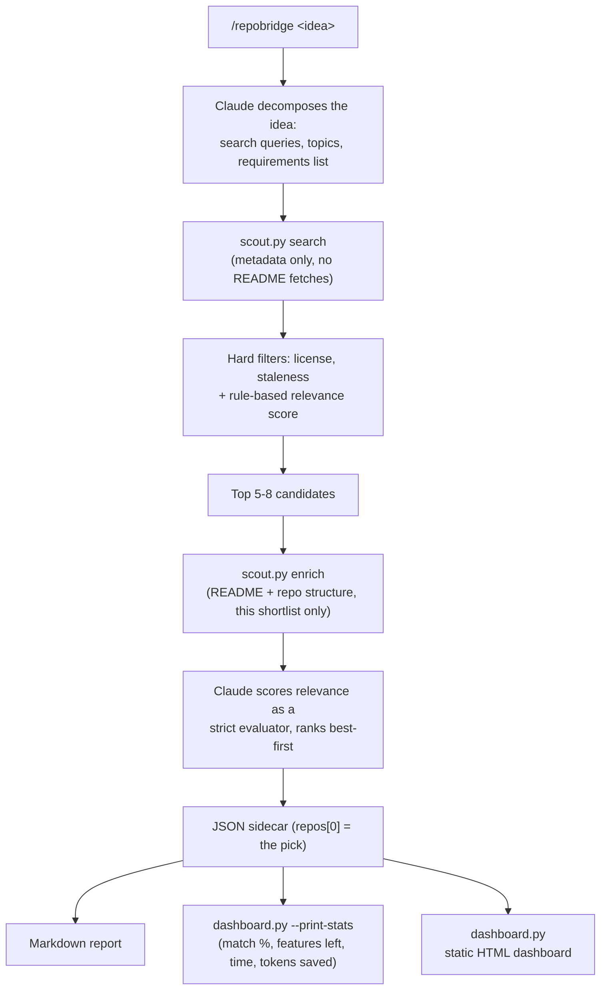

# RepoBridge

**Before you generate an app from scratch, find out how much of it already exists.**

RepoBridge takes a plain-language app idea, searches real GitHub repositories for ones that already solve most of it, and produces an evidence-backed report of what's covered, what's partial, and what's genuinely missing — the actual 15% worth building. It never writes application code itself; it tells you what to build on top of, and what not to bother reinventing.

## Why

Generating code is now nearly free, so it's tempting to generate everything. That produces token-inflated, fragile, redundant software that traditional engineering avoided by default: look for an existing library first, then build the delta. RepoBridge restores that habit as a workflow instead of a discipline you have to remember to apply. It does the two things a human would do manually — search for prior art, then honestly assess how well it fits — and does them with an auditable, rule-based scoring layer instead of vibes.

## How it works



Retrieval and scoring are deliberately split into two stages so the expensive work (fetching README text, checking for CI/Docker/deploy config) only ever runs against a handful of pre-filtered candidates, not every repo that shows up in a search. See [`docs/plan.md`](docs/plan.md) for the full design rationale, including two specific tradeoffs made on purpose:

- **Copyleft licenses (GPL/AGPL) are hard-blocked by default.** A builder using this without a lawyer in the loop shouldn't be able to silently walk into a copyleft obligation on a closed-source project. Override with `--allow-copyleft` if you know what you're doing.
- **The staleness cutoff is 12 months, not 6.** A stable, feature-complete repo can go months without a commit without being abandoned — a tighter cutoff would systematically exclude exactly the kind of "boring, finished" code this tool should prefer. Recency instead weights the *ranking*, not a hard gate.

## Quickstart

**Prerequisites:** Python 3, and GitHub auth via either:
- `gh auth login` (uses your existing GitHub CLI session), or
- a `GITHUB_TOKEN` environment variable

No `pip install` — every script here is Python stdlib only, by design. No database, no server, no API key beyond GitHub's own.

```bash
/repobridge habit tracker with streaks and social accountability
```

This runs inside Claude Code as a skill (`.claude/skills/repobridge/SKILL.md`) — Claude does the semantic reasoning (query generation, relevance judgment, gap analysis); the Python scripts do the deterministic, auditable parts (search, filter, score).

You can also drive the retrieval engine directly, without Claude, for debugging or scripting:

```bash
python3 .claude/skills/repobridge/scout.py search \
  --queries "habit tracker streaks" "accountability partner app" \
  --requirements "streak tracking" "social accountability" "reminders" \
  --min-stars 50 --limit 30

python3 .claude/skills/repobridge/scout.py enrich \
  --repos redpangilinan/iotawise daya0576/beaverhabits
```

## What's in the box

```
.claude/skills/repobridge/
  scout.py        deterministic GitHub retrieval + rule-based scoring (stdlib only)
  dashboard.py    turns scout.py/SKILL.md JSON output into a static HTML dashboard
  SKILL.md        the /repobridge workflow Claude follows
  README.md       skill-level usage notes
tests/
  test_scout.py   33 unit tests against the real scout.py — see Testing below
docs/
  plan.md         the design plan, including review notes and rejected alternatives
repobridge-reports/
  *.md            generated feature-gap reports (one per idea)
  *.json          structured sidecar data behind each report
  *.html          static dashboards generated from that data
```

## The report

Each run produces three artifacts for a given idea, all generated from one JSON sidecar so they can never disagree: a markdown report, the sidecar itself, and a static HTML dashboard.

The dashboard leads with a single answer, not a list — one best-pick hero card, in the spirit of a clean dark-mode answer page: the repo, one to two sentences on *why* it won over the runner-up, and four headline numbers:

| Stat | What it means |
|---|---|
| **Match %** | Present + half-credit Partial, as a share of the idea's stated requirements |
| **Features left** | Count of Missing + Partial requirements for the pick |
| **Est. time remaining** | Heuristic: hours per missing/partial feature, converted to days |
| **Tokens saved** | Heuristic: tokens an LLM would spend generating the covered portion from scratch |

The last two are explicitly estimates, not measurements — the fixed formula behind them (and its constants) lives in `dashboard.py`, and the page always shows the methodology note beside the numbers rather than presenting them as precise. `dashboard.py --print-stats` prints the same numbers as JSON so the markdown report states the identical figures instead of Claude re-deriving them by hand.

Below the hero, every artifact still shows the full comparison — stars, license, verified/deployability scores, and a Present/Partial/Missing grid for every candidate considered, each cell backed by a one-line evidence quote from the README. The single-answer framing up top never comes at the cost of the audit trail underneath it.

A worked example, from a real (unmocked) run against the idea *"habit tracker with streaks and social accountability"*, is checked into `repobridge-reports/`. Its headline finding — none of the four real candidates found had any social-accountability feature — is exactly the kind of honest gap this tool exists to surface; it's not a cherry-picked success case.

## Testing

```bash
python3 -m unittest discover -s tests -v
```

33 tests, no network calls, no mocked-into-passing assumptions — they exercise the actual functions in `scout.py`: the license allowlist and copyleft block, the staleness cutoff at both the default and a custom threshold, the `metadata_score` formula (recency + star cap + keyword overlap), the awesome-list link-extraction regex (including exclusions and dedup), GitHub auth resolution (env var, `gh` CLI fallback, both failure modes), and `api_request`'s fail-loud behavior on rate limits versus its configurable soft-fail on expected 404s.

## Guardrails

- **Fail loud, never degrade silently.** Missing auth, a rate limit, or zero surviving candidates all exit non-zero with a clear message — never a guessed or partial result presented as real.
- **No dynamic execution of fetched content.** README text and repo metadata are data, never `eval`'d or shelled out.
- **Deterministic scoring stays auditable.** Every score ships alongside the exact signals that produced it (`score_breakdown`, `verified_signals`, `deployability_signals`) — nothing is a hidden weighting.
- **All GitHub access goes through `scout.py`.** Claude never calls the API directly, so auth, filtering, and error-handling logic live in one place.
- **No secrets in output.** The token is read from the environment and never echoed, including in error messages.
- **Estimates are labeled as estimates.** Time-remaining and tokens-saved are heuristic, not measured — they always ship with the formula's methodology note, never as bare precise-looking numbers.

## What this deliberately doesn't do

RepoBridge stops at analysis. It does not clone repositories, does not write application code, and does not decide the "diff-only" implementation step for you — that's a separate, lower-risk problem (it's mostly a well-scoped prompt) that doesn't need solving before the harder question does: can this tool reliably tell you what already exists and what doesn't? That's what's built and tested here.
